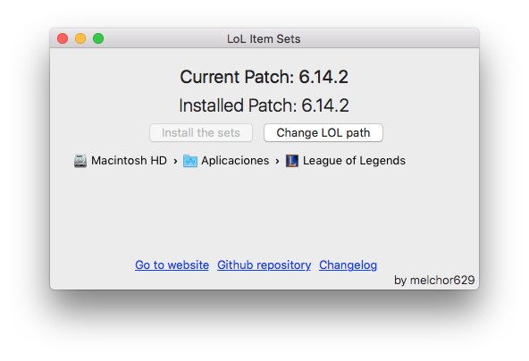

# LoL-item-sets for Mac

 

Download and automatically install the lastest LoL item sets from the website : lol-item-sets-generator.org

Windows version here : https://github.com/Ilshidur/LoL-item-sets

## Reporting a bug

* Bug on the **application** : [submit here](https://github.com/Ilshidur/LoL-item-sets-Mac/issues/new)
* Bug on the **item sets** : [submit here](https://github.com/Ilshidur/feeder.lol-item-sets-generator.org/issues/new)

## Requirements

 - Mac OS X 10.9 or higher

## Contact

Contact me at [ilshidur@lol-item-sets-generator.org](mailto:ilshidur@lol-item-sets-generator.org) or [ilshidur@gmail.com](mailto:ilshidur@gmail.com).

## Contributors

Thanks goes to these wonderful people ([emoji key](https://github.com/kentcdodds/all-contributors#emoji-key)):

<!-- ALL-CONTRIBUTORS-LIST:START - Do not remove or modify this section -->
| [ Nicolas COUTIN](https://www.nicolas-coutin.fr) [💬](#question-Ilshidur "Answering Questions") [📖](https://github.com/Ilshidur/LoL-item-sets-Mac/commits?author=Ilshidur "Documentation") [👀](#review-Ilshidur "Reviewed Pull Requests") [🔧](#tool-Ilshidur "Tools") [🚇](#infra-Ilshidur "Infrastructure (Hosting, Build-Tools, etc)") | [ Melchor Garau Madrigal](http://melchor9000.me) [💬](#question-melchor629 "Answering Questions") [🐛](https://github.com/Ilshidur/LoL-item-sets-Mac/issues?q=author%3Amelchor629 "Bug reports") [💻](https://github.com/Ilshidur/LoL-item-sets-Mac/commits?author=melchor629 "Code") [🎨](#design-melchor629 "Design") [📖](https://github.com/Ilshidur/LoL-item-sets-Mac/commits?author=melchor629 "Documentation") |
| :---: | :---: |
<!-- ALL-CONTRIBUTORS-LIST:END -->

This project follows the [all-contributors](https://github.com/kentcdodds/all-contributors) specification. Contributions of any kind welcome!